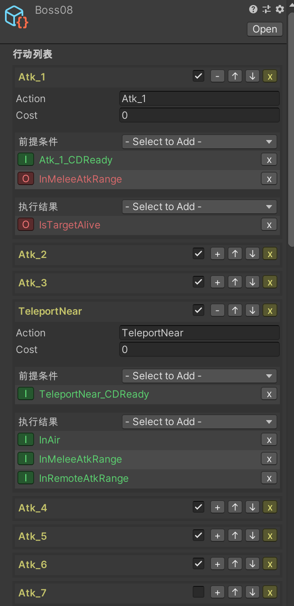
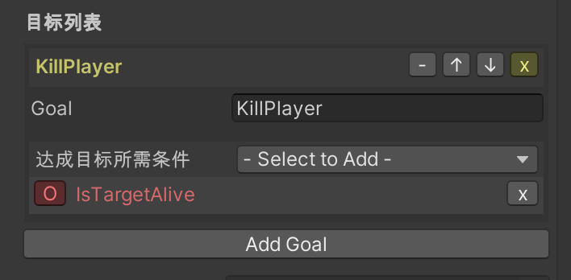
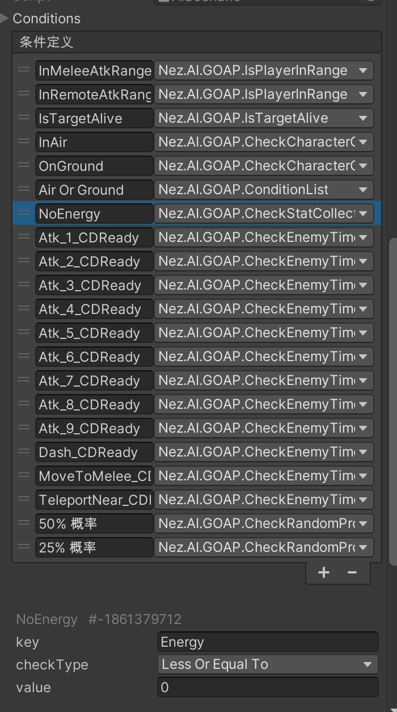

# UnityGoapAIDemo
this is a demo project for GOAP AI.

这个演示是我在"SeedHunter"项目后期实现敌人AI时的一个尝试，效果不错，参数调整比较简单。

我将SeedHunter项目中使用Goap的第一个Boss单独拿了出来

### AIScenario ( GOAP AI配置 )
- 行为列表
    每个行为都有其执行的先决条件和执行结果

- 目标列表

- 条件列表

    创建一个新类继承自Nez.AI.GOAP.AICondition可以自定义条件，
    在面板中可以调整条件的参数

### 项目中使用到的第三方库
* Goap修改自Nez (https://github.com/prime31/Nez)
* GoapEditorGUI修改自 (https://github.com/AntKarlov/GOAP)
* PlayMaker，我使用这个状态机插件来实现敌人逻辑
* NodeCanvas，我使用其中的Blackboard组件，调整变量比较方便
* RPGStatSystem，用于描述角色的各种属性值，修改自 (https://jkpenner.wordpress.com/category/rpg-stat-system/)
* Cuphead，还有一些比较方便的代码从茶杯头中反编译得到
* 美术、动画资源出自SeedHunter

### 一些小问题
* 发射箭的位置有些对不上 (请忽略它)
